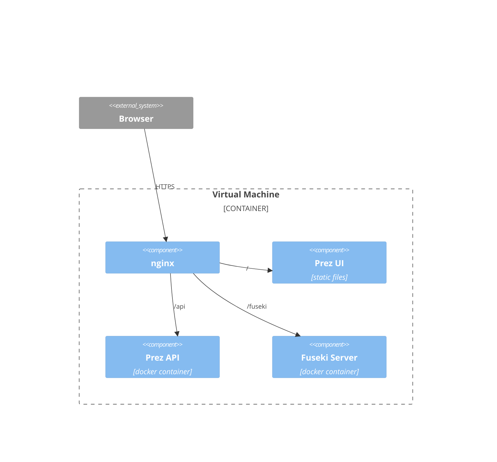

# ANU FNP Catalog Infrastructure

This repository contains infrastracture deployment code for the Australian National
University, First Nations Portfolio's Catalog.

https://anufncatalogue.anu.edu.au

> [!NOTE]  
> You currently need an NCI account and assignment to the fnp project in NCI to access
> the catalog.

## Dependencies

You will need to have the following tools installed:

- [uv](https://docs.astral.sh/uv/getting-started/installation/)
- [task](https://taskfile.dev/installation)
- [pnpm](https://pnpm.io/installation)

You will also need to have a VM created with SSH access enabled and a https domain

## Overview

The Provided Virtual machine will have the following configuration after running the
code in this repository.



- Fuseki and Prez are docker containers executed by Podman, managed by systemd,
- Prez-UI static files are served by nginx,
- nginx is installed on the host and runs as a systemd service,
- certbot is used to generate a letsencrypt signed SSL certificate for the given domain,
- a cron job is created for certbot to automatically renew the SSL certificate.

## Usage

First off, you need to build the Prez-UI static files for the prez-ui custom theme

> [!NOTE]  
> `https://your-vm-domain/api` must be the endpoint where the Prez API will be accessible.
> by default this will be the root domain of the VM + /api

```bash
echo 'NUXT_PUBLIC_PREZ_API_ENDPOINT=https://your-vm-domain/api' > prez-ui/.env
task build:prez-ui
```

Set variables for Ansible by editing the [vars.yaml](./deploy/vars.yaml) file.

> [!NOTE]  
> you should only need to change the vm.domain and vm.username variables.
> Other variables can be changed, but should be left as default.

and the [hosts.yaml](./deploy/hosts.yaml) file.

> [!NOTE]  
> you need to update the vm host domain and provide the path to your SSH Private key.

and add secret variables to the vault:

```bash
echo 'your-vault-password' > deploy/ansiblepass
uv run ansible-vault create deploy/vault.yaml --vault-password-file deploy/ansiblepass
```

The required vault structure is:

```yaml
fuseki:
  dataset: anufncat
  username: admin
  password: admin

letsencrypt:
  email: email@example.com
```

Then deploy:

```bash
task deploy
```
